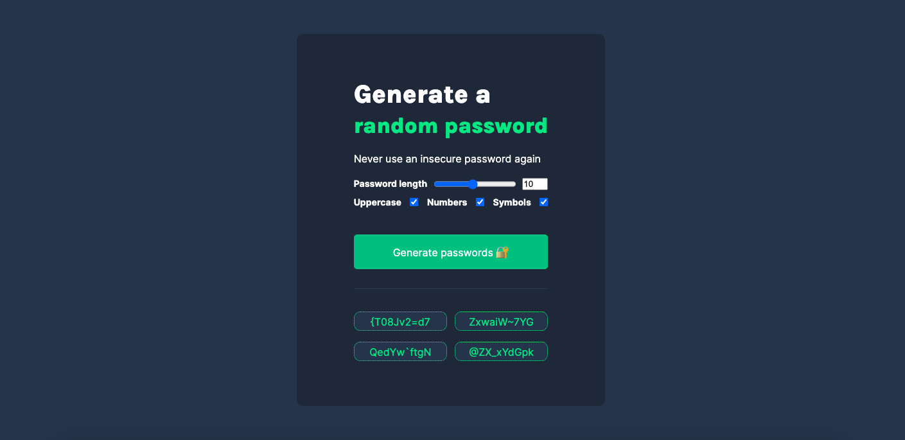

# Password Generator  

Project for Scrimba's Front-End Developer Career Path where we built a Password Generator with HTML, CSS, and Javascript.
https://www.scrimba.com

##

## Built with:

  

 
## Preview

## Video

https://github.com/dev-evelin/password-generator/assets/107203586/374f0194-6c06-44f6-91a9-995dcea975de

 

## Links

- Live Site URL: [[https://dev-evelin-twimba.netlify.app/](https://your-live-site-url.com)](https://dev-evelin-password-generator.netlify.app/)

## Connect with me::

https://www.linkedin.com/in/dev-evelin/

 
